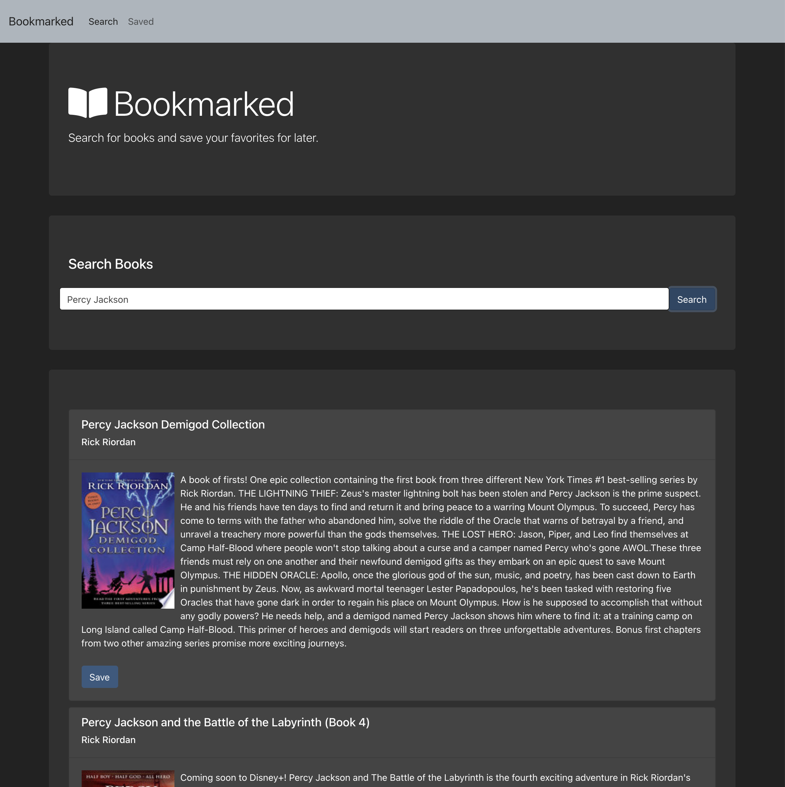

# Bookmarked

## Deployed

[Access the deployed web application here.](https://bookmarked-ck.herokuapp.com/)

## Purpose

Search for books by title or author and save your favorites to the database so you can access them later.

## Instructions for Use

1. Search for any book or book series by title or author.
2. Click the Save button beneath any book you'd like to save.
3. View your saved books on the Saved page.
4. If you'd like to remove any saved books, click the delete button under that book on the saved page.

## Tech

This application leverages:

* HTML
* CSS
* Bootstrap
* JavaScript
* MERN Stack
    * MongoDB
    * Express.js
    * React.js
    * Node.js

